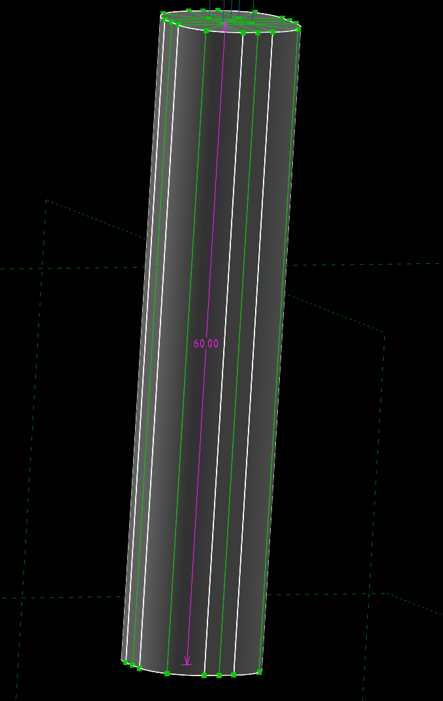
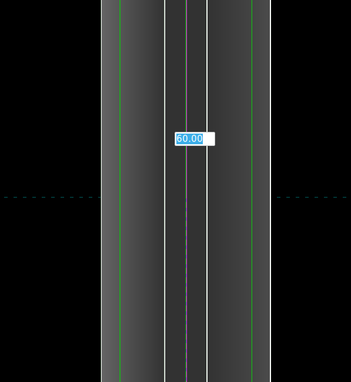
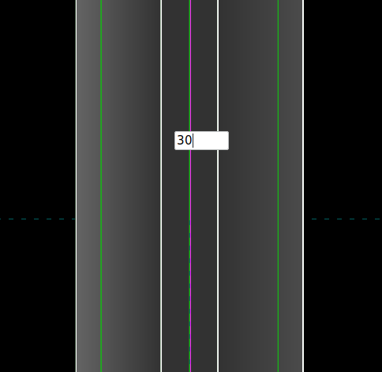
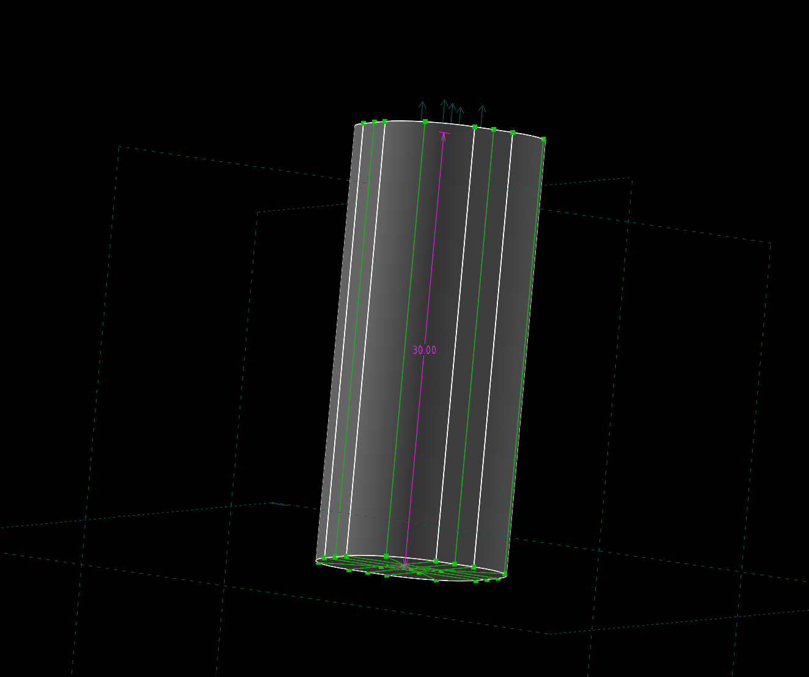

# High Stakes
Universal, customizable tenting system

By using Solvespace you can easily customize length and diameter of the legs

So this system can be applied to any keyboard, provided that you are able to make a simple slide-in mechanism on the bottom plate
